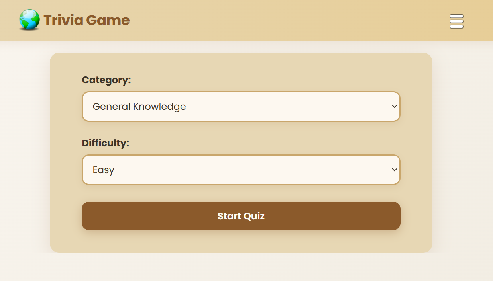

# Trivia Game

Trivia game application built with React and TypeScript.

The app allows users to configure the quiz (category and difficulty), answer timed questions, track their score in real time, and see the final result at the end of the game.

Questions are fetched from a public trivia API and the game includes a countdown timer for each question. Game statistics are persisted using localStorage.

---

## Features

- Select quiz category and difficulty
- Fetch trivia questions from an external API
- Multiple-choice questions with instant feedback
- Countdown timer per question
- Score tracking
- Final results screen
- Persistent statistics (localStorage)
- Games played, best score, last score, average score
- Loading and error states
- Clean and modular component structure
- Responsive layout

---

## Tech Stack

- React + TypeScript
- useState, useEffect
- Custom async data fetching
- Conditional rendering
- CSS3 (Flexbox)
- External REST API
- Browser localStorage

---

## Quick Start

```bash
git clone https://github.com/adrianmarceloledesma/trivia-game
cd trivia-game
npm install
npm run dev
```

## Live Demo

https://trivia-game2026-kohl.vercel.app/

## Preview



## Project Structure

```
Project Structure
src/
├─ components/
│ ├─ QuestionCard.tsx
│ ├─ FormOptions.tsx
│ ├─ Finished.tsx
│ └─ MyStats.tsx
├─ hooks/
│ └─ fetchTrivia.ts
├─ types/
│ ├─ Question.ts
│ ├─ UserAnswer.ts
│ └─ GameStat.ts
├─ App.tsx
└─ main.tsx
```
